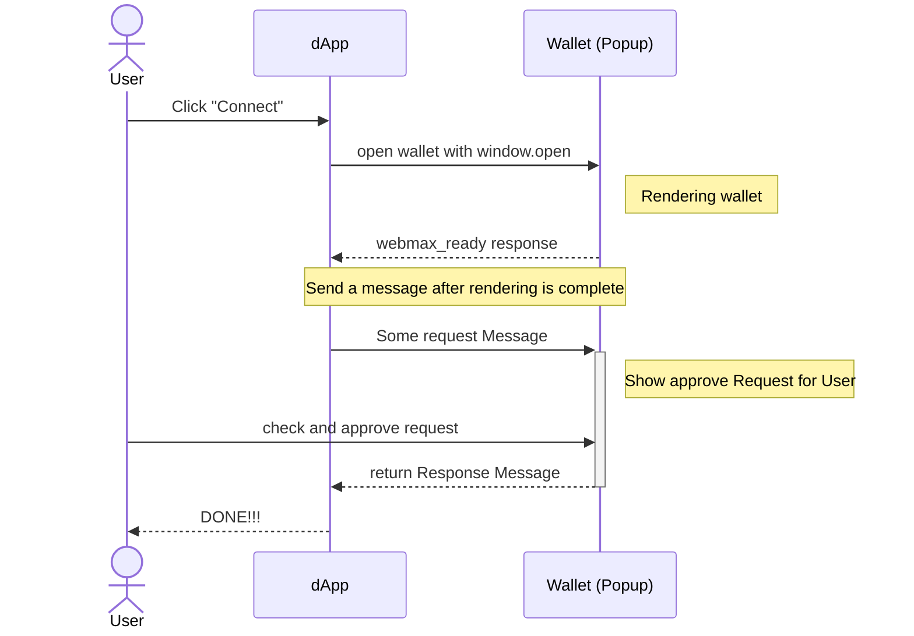

# API Reference

## Summary of Protocol Flow

The following illustrates the flow when a Dapp calls methods like `eth_requestAccounts` on a Web Wallet.



1. The user clicks the "Connect" button on the dApp.
2. The dApp uses `window.open` to open the wallet.
3. The wallet is opened and initialized.
4. After initialization, the wallet sends a `webmax_ready` message.
5. After confirming initialization, the dApp sends a message like `eth_requestAccounts`.
6. The wallet displays the request to the user.
7. The user checks and approves the request.
8. The wallet sends a response.
9. The dApp receives the response and may close the Window.

## Message Format

### Extended JSON-RPC

Many wallets for blockchains like Ethereum provide their operations as JSON-RPC methods. Based on these, we define a message format that inherits from JSON-RPC as follows.

```tsx
export type AbstractRequest<NS extends string = string, Params = unknown> = {
  id: number;
  namespace: NS | ChainedNamespace<NS>;
  method: string;
  params: Params;
  metadata?: unknown;
};

export type AbstractSuccessResponse<NS extends string = string, Result = unknown> = {
  id: number;
  namespace: NS | ChainedNamespace<NS>;
  method: string;
  windowHandling: WindowHandling;
  result: Result;
};

export type AbstractErrorResponse<NS extends string = string> = {
  id: number;
  namespace: NS | ChainedNamespace<NS>;
  method: string;
  windowHandling: WindowHandling;
  error: { code: number; message: string };
};

export type AbstractResponse<NS extends string = string, Result = unknown> =
  | AbstractSuccessResponse<NS, Result>
  | AbstractErrorResponse<NS>;
```

### Namespace

Each method requires a Namespace, defining the group of methods. The Namespace must be included in each request, and it can also include ChainID information.

```tsx
type ChainId = string | number;
type Namespace = "eip155" | "webmax";
type ChainedNamespace = `${Namespace}:${ChainId}`;
```

**Window Handling**: Specifies how to handle the Wallet's Window after sending a response. This is useful, for example, when the wallet wants to display an error message.

```tsx
type WindowHandling = "keep" | "close";
```
