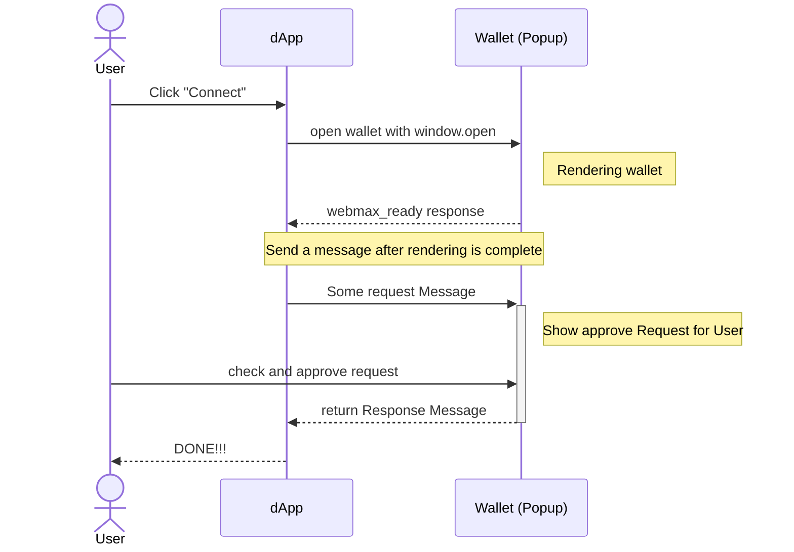

# Wallet SDK Reference

### Introduction

Welcome to the INTMAX WalletSDK Protocol documentation. This guide will help you understand the core concepts of the protocol, how to quickly start using the SDK for wallet and dApp examples, and provide a comprehensive API Reference.

### What is INTMAX WalletSDK?

INTMAX WalletSDK is a protocol and SDK designed to facilitate seamless integration between web wallets and decentralized applications (Dapps). This SDK is built to enable direct communication and connection between web-based wallets and Dapps, leveraging the power of EIP1193-like interactions to enhance user experiences across the blockchain ecosystem.

### Overview of INTMAX WalletSDK Protocol

The INTMAX WalletSDK protocol is a simple yet powerful solution that allows Dapps to interact with web wallets through a standardized interface. This is achieved by defining communication methods and data structures that enable EIP1193-compliant interactions between web wallets and Dapps. The protocol is designed to work with web wallets provided as web pages and Dapps, facilitating a wide range of applications and extensions.

### Core Features

- **EIP1193 Compatibility**: The protocol is designed to be compatible with EIP1193, ensuring that Dapps can operate web wallets through a standardized interface. This compatibility is crucial for building Dapps that can interact with a variety of blockchain networks.
- **Cross-Origin Communication**: Utilizing `postMessage` and `MessageEvent`, the protocol enables secure, cross-origin communication between the Child Window (a window of the Web Wallet opened by a Dapp) and the Dapp itself.
- **Flexible and Extensible**: The protocol is designed to be flexible, allowing it to be used with chains other than EVM-based ones. This makes it a versatile solution for developers looking to integrate web wallets into their Dapps.
- **User Experience**: By enabling direct communication between web wallets and Dapps, the protocol enhances the user experience by streamlining the process of connecting wallets to Dapps.

### **Protocol Flow**

The following illustrates the flow when a Dapp calls methods like `eth_requestAccounts` on a Web Wallet.

1. The user clicks the "Connect" button on the dApp.
2. The dApp uses `window.open` to open the wallet.
3. The wallet is opened and initialized.
4. After initialization, the wallet sends a `webmax_ready` message.
5. After confirming initialization, the dApp sends a message like `eth_requestAccounts`.
6. The wallet displays the request to the user.
7. The user checks and approves the request.
8. The wallet sends a response.
9. The dApp receives the response and may close the Window.
