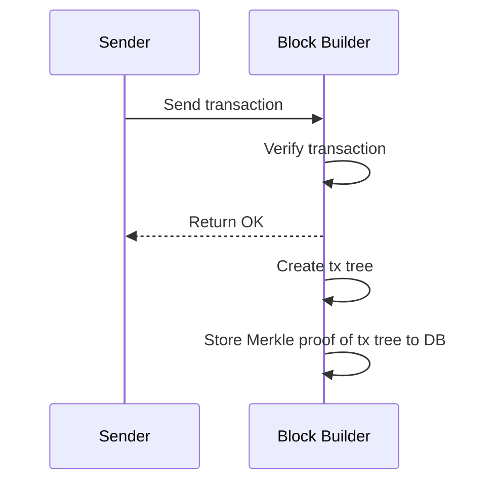
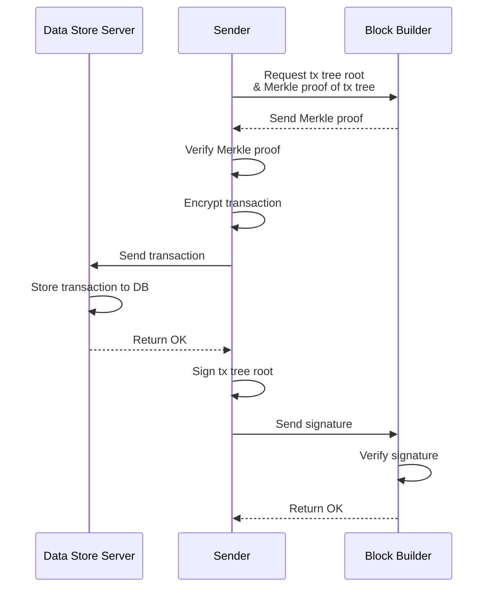
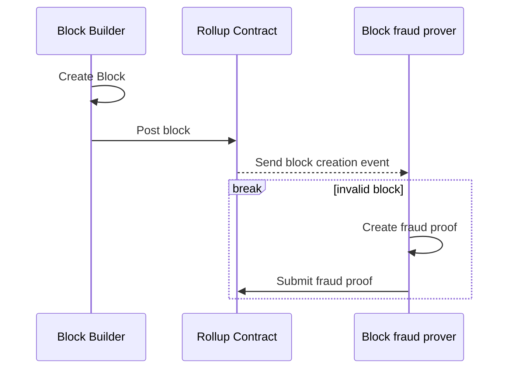
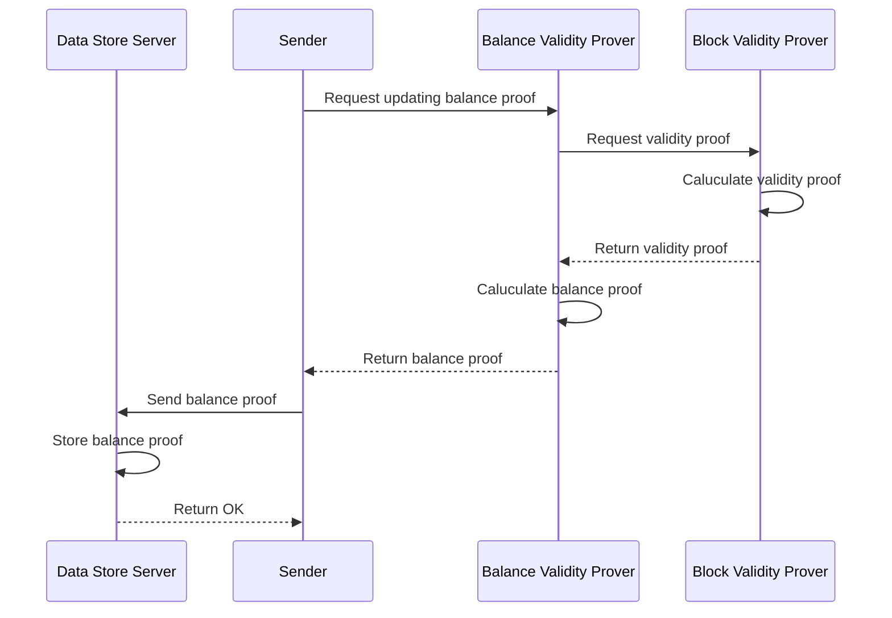
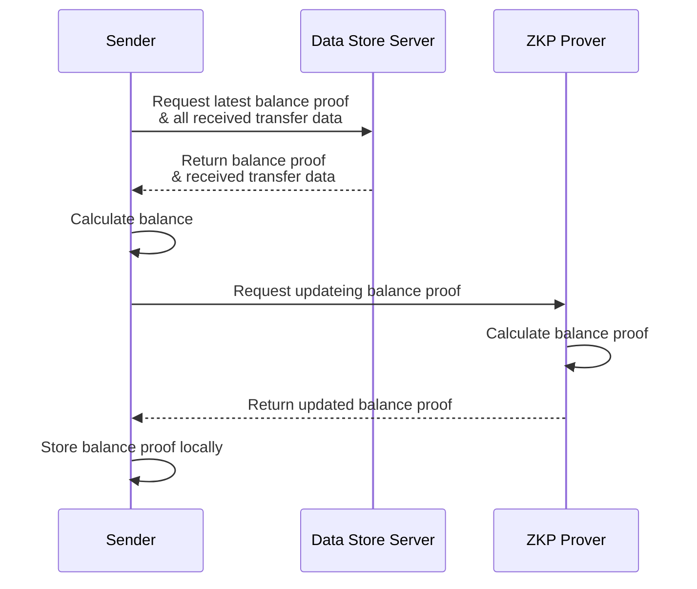

# Transfer flow

## Version

**Version Number**: v0.2.0

**Update Date**: 16.06.2024

## Overview


## Protocol

**Related Parties**

- Sender
- Recipient
- Block Builder
- Data Store Vault
- Balance Validity Prover
- Block Validity Prover

### Overall Flow

**Transfer Process**


### Send Transaction



Steps

1. The sender prepares the `transferData` consisting of `recipient`, `amount`, and `salt`. A single transfer transaction can include up to 128 `transferData` items.
    1. `addressType`:
        1. INTMAX: Used for specifying an address on INTMAX, mainly for transfers within INTMAX.
        2. ETHEREUM: Used for specifying an address on Ethereum, mainly for withdrawals from INTMAX to Ethereum.
    2. `address`:
        1. INTMAX Address: 32 bytes hex.
        2. ETHEREUM Address: 20 bytes hex.
    3. `amount`:
        1. Specified as a string. For example, depending on each token's decimals, 1 token would be represented as 10^18 for ETH or 10^6 for USDC.
    4. `salt`:
        1. A random 32 bytes hex. Each `transferData` within the same transaction must use a different salt to uniquely identify each transfer.
    
    Example (JSON):
    
    ```json
    // Single TransferData
    {
        "recipient": {
            "addressType": "INTMAX",
            "address": "0xabc...def"
        },
        "amount": "123",
        "salt": "0xabc...def"
    }
    
    // Multiple TransferData
    [
        {
            "recipient": {
                "addressType": "INTMAX",
                "address": "0xabc...def"
            },
            "amount": "123",
            "salt": "0xabc...def"
        },
        {
            "recipient": {
                "addressType": "ETHEREUM",
                "address": "0xabc...def"
            },
            "amount": "123",
            "salt": "0xabc...def"
        }
    ]
    ```
    
2. Calculate `transfersHash` by bundling multiple `transferData` and `tokenIndex`.
    - `transfersHash` is a Poseidon hash of `transferTreeRoot` and `tokenIndex`.
        - `transfersHash` = Poseidon(`transferTreeRoot`, `tokenIndex`)
3. Create a transaction by bundling multiple `transferData` and `tokenIndex`.
    
    Example (JSON):
    
    ```json
    {
        "feeTransferHash": "0x123...456",
        "transfersHash": "0xabc...def",
        "nonce": 1
    }
    ```
    
    - A transaction can send the same type of token to up to 128 recipients at once.
    - `transferData` can include both INTMAX and ETHEREUM address types.
    - Refer to [transfer tree](/others/data-structure.md) for the structure of `transferTreeRoot`.
    - Include the fee transfer data `feeTransfer`.
    - The transaction includes the hashed transfer data, the address of the token to be sent, the hash of the fee transfer data, and the number of times the transaction has been executed.
    - Refer to [token index](/others/data-structure.md).
    - The initial value of `nonce` is 1. Specify the number of transactions executed by the sender plus 1.
4. Calculate the transaction hash from the transaction data and then compute the PoW nonce from it.
    - Refer to [PoW nonce](/others/data-structure.md) for the calculation method.
    - The difficulty of computing the PoW nonce is determined as `DIFFICULTY` by each block builder node. The higher the `DIFFICULTY`, the more computational resources are required by the user.
    - **NOTE**: This mechanism addresses the issue where a user executes a transfer but does not sign it, preventing the block builder from collecting the fee despite posting the block. The computation load mitigates spam from users without influencing the block hash or ZKP inputs.
5. The user receives a list of active block builder nodes from the indexer node.
    - Use the URL at the top of the list.
6. The user verifies if the received URL functions as a block builder.
    - Execute the block builder's health check API.
7. The user sends the transaction data and PoW nonce to the block builder.
    - Request to the block builder:
        - `feeTransferHash` (string): The hash of the fee transfer request sent to the block builder.
        - `transfersHash`: Poseidon hash of `transferTreeRoot` and `tokenIndex`.
        - `nonce` (number): The number of transfers executed by that public key.
        - `powNonce` (string): PoW nonce.
8. The block builder verifies the transaction.
    - If valid, proceed to the next step.
    - If the format is incorrect, return an exception indicating the transaction format error.
        - This likely indicates a bug in the client's program.
9. The block builder verifies that the PoW nonce satisfies the [PoW conditions](/others/data-structure.md).
    - If satisfied, proceed to the next step.
    - If not, return an exception indicating "Insufficient PoW response."
10. The block builder verifies that it has at least 0.1 ETH staked in the rollup contract.
    - If sufficient, proceed to the next step.
    - If not, return an exception indicating "Insufficient stake" and prompt the block builder to either:
        - Restart the node with enough ETH in the rollup contract if auto-stake is disabled.
        - Automatically stake to the rollup contract if auto-stake is enabled, similar to the block builder initialization.
11. The block builder saves the transaction in the database.
    - **NOTE**: The data may not need to be stored in the database if held temporarily.
12. The block builder waits until either 128 transactions are collected or 1 minute has passed since the last unprocessed transfer was received.
    - Two types of blocks can be created: one with transactions where the sender list is given by public keys and another where the sender list is given by account IDs. Once 128 transactions of either type are collected, proceed to the next step.
13. The block builder creates the tx tree and stores it in the database.
    - **NOTE**: The data may not need to be stored in the database if held temporarily.

**Error Handling**

- If the user requests the next transaction without reflecting the previous transfer in the balance proof:
    - The user cannot provide the recipient with a correct balance proof until the previous transfer is reflected.
- If the transaction format verification fails:
    - The transaction from that sender will not be executed.
- If the block builder does not create the tx tree:
    - The block will not be posted, and the transaction will not be executed.
- If the block builder stops before saving the tx tree to the database:
    - Resume from the creation of the tx tree.

### Approve proposed block



Steps

1. The user sends a request to the block builder to check if a block containing their transaction has been created. The block builder processes the request as follows:
    - If the block builder has the block containing the transaction, it returns the following data to the user:
        - The root hash of the tx tree.
        - The Merkle proof from the user's transaction hash to the tx tree root.
    - If the block builder does not have the tx tree but knows the transaction, it informs the user that the block has not been created yet with an error message.
    - If the block builder does not know the transaction, it informs the user that the transaction is unknown with an error message.
2. The user verifies the correctness of the data sent by the block builder:
    - Ensures it is a Merkle proof with their transaction hash as the leaf.
    - If the user previously signed a block from another block builder containing the same transaction, they discard the data from the current block builder.
    - Checks that the block builder has a sufficient stake on Scroll.
3. The user sends the transaction and the block hash to the data store server for storage:
    - The transaction data is sent to the data store server to be stored in the DB.
    - All transactions sent by the user are required when reconstructing the balance proof.
    - To prevent signing another block with the same transaction by mistake, the same transaction data is sent to multiple block builders.
4. The user signs the `txRoot` and sends the signature to the block builder that created the block.
5. The block builder verifies the signature received from the user:
    - If the block builder does not know the block containing the transaction, it returns an exception.
    - If the verification fails, it informs the user with an error message that the verification did not pass.
6. The block builder confirms that the received signature is correct:
    - The block builder waits about 15 seconds for the user's return signature.
        - **NOTE**: Due to potential incorrect values from some block builders, users are given ample time for verification.

**Error Cases**

- If the block builder does not return the Merkle proof and the proposed block:
    - The transaction will not be executed unless the user agrees to the proposed block and signs it. The SDK automates the process of choosing another builder.
        - Normally, a list of block builders is obtained from the indexer, using the first URL.
        - If the user decides not to wait any longer and clicks the resend button, the next URL in the list will be used. If all URLs have been tried, a new list of block builders is retrieved from the indexer, starting from the first URL again.
- If the Merkle proof returned by the block builder is incorrect:
    - The user does not agree to the proposed block, similar to the case above.
- If the sender leaves before taking a backup on the data store server:
    - If the user does not return before the block builder closes signature aggregation, the transaction will not be executed.
- If the user stops the process before sending the signature to the block builder:
    - The transaction will not be executed, as in the cases above.

### Post block



Steps

1. The block builder creates a block.
    - For the method of generating block data, refer to [block](/others/data-structure.md).
    - If the aggregated signature submitted by the block builder is incorrect, all transactions included in that block will be invalid. They will be skipped when creating the block validity proof ZKP.
        - The block builder will not receive the transaction fees they were supposed to collect from the users.
2. Post the block to the rollup contract.
    - Blocks can be posted in batches.
    - There is no set interval or specific block generator; any node that successfully creates a block can post it.
        - The block hash is calculated on the contract side.
    - Verification details on the contract:
        - Verify the pairing using the aggregated public key and message point.
    - Contract storage data to be updated:
        - The latest block number.
        - Block hash:
            - Not only the latest one but also past block hashes should be retained.
        - **NOTE**: No additional data is needed for registering public keys.
    - Whether the aggregated public key was calculated from the public keys of the senders included in the block will be verified by Plonky2.

**Error Cases**

- If the block builder receives a signature from a sender but does not reflect it in the block before posting:
    - The block itself is valid, but the builder will not receive the fee from that sender.
- If the block builder gathers signatures from senders but does not post the block:
    - The transaction will not be executed until it is posted.
    - The sender can execute the transaction with the same nonce to reflect only one of the transactions.
- If the block builder does not have a stake, the rollup contract will revert.
- If the block builder sends an incorrect signature, the contract state can be checked to determine if the block is incorrect.
    - A block fraud prover can submit a fraud proof.
        - There is no need to record whether the block is incorrect in the contract.
        - Transactions in that block will be invalidated by the block validity proof.

### Receive block validity proof



Steps

1. The block validity prover creates a block validity proof that includes the new block and saves it in the DB.
2. The user requests the balance validity prover to update their balance proof (enough balance proof).
    - Data required for the request:
        - Current balance proof.
        - Current balance data.
        - Data to be updated:
            - Transaction data if the user is the sender.
            - Transfer request data if the user is the recipient.
            - Deposit request data if reflecting a deposit.
3. The balance validity prover receives the latest block validity proof from the block validity prover.
4. The balance validity prover calculates the new balance proof and returns it to the user.
5. The user sends the received balance proof to the data store vault.
6. The data store server saves the new balance proof and the new balance in the DB.

**Error Cases**

- The block validity prover does not calculate the block validity proof:
    - Balance updates cannot be calculated.
        - Although it may take time, anyone can create a block validity proof from the on-chain state.
- The user stops the process before updating the balance proof:
    - The balance proof will be updated before the next transaction.

### Synchronize balance proof



Steps

1. Receiver receives transfer data from the sender:
    - Transfer proof:
        - Transfer data.
        - Merkle proof and its index in the transfer tree.
        - Merkle proof and its index in the tx tree.
    - The block number in which the transfer is included.
    - Sender’s balance proof (Plonky2 proof) just before the block where the transfer is included.
    - Proof that the sender has sufficient balance after the transfer:
        - This is different from the enough balance proof.
2. Receiver verifies the sender’s balance proof and the proof of sufficient balance.
3. Receiver checks that the transfer hash of the received transfer data is not included in their own [merged tx nullifier tree](/others/data-structure.md), and calculates a non-inclusion proof and the updated merged tx nullifier tree with the new transfer hash.
    - Ensures that the transfer data has not been merged before.
    - Verifies that the sender’s public key is included, preventing other senders from generating the same transfer hash.
4. Receiver obtains the block details using the block number from the rollup contract's `BlockPosted` event logs.
5. Receiver receives the block validity proof from the block validity prover:
    - Block validity proof: A Plonky2 proof aggregating the block contents.
    - Merkle proof of the specified block number in the block hash tree.
    - Merkle proof of the corresponding sender in the account tree.
6. Receiver verifies the Merkle proofs of the block hash tree and account tree:
    - Confirms the block number of the transfer is included in the block hash tree.
    - Verifies that the last seen block number recorded in the account tree matches or exceeds the block number of the transfer.
7. Receiver verifies the Merkle proof provided by the sender:
    - Confirms the correctness of the Merkle proof from the block hash tree root to the transfer data.
8. Receiver verifies the block validity proof.
9. If the following conditions are met, the receiver can reflect the transfer in their balance:
    - The aggregated Plonky2 proof of the block contents is correct.
    - The block hash tree includes the block number of the transfer.
    - The last seen block number in the account tree matches or exceeds the block number of the transfer.
    - The Merkle proof from the block hash tree root to the transfer data is correct.
    - The Merkle proof showing non-inclusion of the transfer hash in the old merged tx nullifier tree.
    - The Merkle proof showing inclusion of the transfer hash in the new merged tx nullifier tree.
    - The new balance, after adding the received transfer amount to the previous balance, matches the updated balance.
        - The balance hash is included in the public inputs.

**Error Cases**

- Balance proof not updated before the next transfer:
    - The transaction can be executed, but the receiver cannot verify the sender's balance, so the receiver cannot accept the transfer.

## Transaction Validation in INTMAX

In INTMAX, transaction validation cannot be performed on the server or contract side because Block Builder and the Rollup Contract cannot know the contents of the transactions for privacy reasons.

To validate transactions, the client side must be fully trusted. Once a transaction is sent from the client side, it cannot be canceled, even if it does not affect the balance.

### Countermeasures

- **Develop a fully trusted validation mechanism on the client side within our INTMAX Client SDK.**
- Ensure that companies integrating INTMAX execute transactions through the INTMAX Client SDK.

### Specification notes

- Transactions sending tokens with insufficient balance are accepted and executed.
- If the balance becomes sufficient in the future, previously unreflected transactions will be reflected. These transactions cannot be canceled and require careful handling.
- Transactions sending nonexistent token indexes are executed but will not be reflected in the balance proof.
- The sender's balance is updated first, followed by the receiver's balance update.
